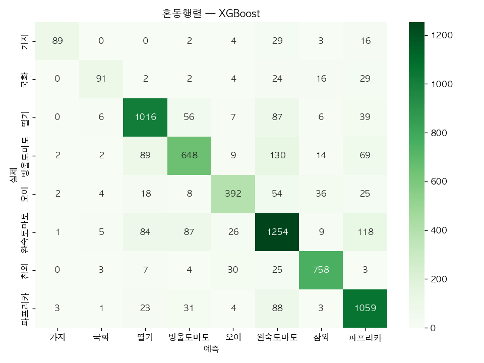

# 🌱 SmartFarm AI — 작물 재배 도우미 (ML → DL → LLM)

> **센서는 환경 숫자를 보여주지만, 이 AI는 작물에 뭘 해줘야 할지를 알려준다.**
> 스마트팜 환경·잎 사진을 받아 **작물 분류 → 잎 병해충 진단 → 자연어 처방**까지 가는 멀티모달 AI.
> 작물 **토마토 단일로 시작 → 전이학습으로 다작물 확장** (딸기·오이·참외…).

[](https://www.python.org/)


[](https://smartfarm-ai.streamlit.app/)

> 🚀 **라이브 데모:** [Phase 1 ML — 환경 → 작물 분류](https://smartfarm-ai.streamlit.app/) &nbsp;·&nbsp; 📄 **수행내역서:** [① ML](docs/phase1_ml.md) · [② DL](docs/phase2_dl.md) · [③ LLM](docs/phase3_llm.md)

---

## 📌 진행 단계

| Phase | 내용 | 기술 | 상태 |
|---|---|---|---|
| **1. ML** | 스마트팜 환경 → 작물 9종 분류 (2022~24 다년) | RandomForest·XGBoost | ✅ 완료 |
| **2. DL** | 잎 사진 → 병해충 진단(CNN·YOLO) + 환경 시계열(LSTM) | PyTorch·전이학습·Grad-CAM·MLflow | ✅ 완료 |
| **3. LLM** | 진단+환경 → 자연어 처방·알림 | Claude API·RAG | ⚪ 예정 |

문서: [PRD](docs/prd.md) · [로드맵](docs/roadmap.md) · [설계 결정(ADR)](docs/decisions.md) · [Phase1 ML](docs/phase1_ml.md) · [Phase2 DL](docs/phase2_dl.md)

---

## ✅ Phase 1 (ML) — 환경 기반 작물 분류

농촌진흥청 스마트팜 현장 농가 데이터(**2022~2024 다년 결합**)로 **환경 센서 → 작물 9종 분류**.

- 288만 시간별 데이터 → **116,365 일별 집계**, 9작물(완숙토마토·방울토마토·딸기·오이·참외·파프리카·가지·국화·수박)
- 모델 비교: **XGBoost 베스트** (test F1 0.68 · GroupKFold F1 0.49)
- 🔑 **핵심 교훈 — 데이터 누수:** 랜덤 분리 F1 **0.67** vs 농가 단위(GroupKFold) F1 **0.49**.
  → 같은 농가가 train·test에 섞이면 성능이 과대평가됨. **정직한 일반화 성능은 0.49**. (자세히 → [phase1_ml.md](docs/phase1_ml.md))
- 📈 **데이터 양 효과:** 2022 단년 → 다년 결합(3.5배)으로 공통 8작물 F1 **+0.073**, 누수 격차 36%p→18%p 완화, 수박 신규 커버.



- 🚀 **라이브 데모:** https://smartfarm-ai.streamlit.app/ — 환경값 입력 → 작물 9종 예측 (4탭: 예측·작물 가이드·모델 평가·EDA)

---

## ✅ Phase 2 (DL) — 잎 병해 진단 + 환경 시계열

토마토 잎 사진 → **3분류 진단(CNN)** + **병해 잎 위치 검출(YOLO)** + 환경 **시계열 예측(LSTM)**. ML이 못 하던 **이미지·순서** 모달리티를 더하고 설명가능 AI까지.

- **전이학습 3분류**(정상·잎곰팡이병·황화잎말이) — 백본 비교를 **MLflow**로 추적(mobilenet_v2 0.987·resnet18 0.971) → **서빙 ResNet18**(Grad-CAM 호환, 평가 **acc 0.97 · ROC-AUC 0.997**)
- 🔑 **데이터 정제:** AI Hub 071 정상 원천에 과실·꽃·줄기 혼재 → **잎(area=3)만 선별** + 질병 확보(정상 1,330·질병 2,616)로 0.94→0.97~0.99
- **Grad-CAM** 판단 근거 시각화(+한계 직시) · **YOLOv8n** 병해 잎 위치 **mAP@50 0.78**
- **서빙 강건화:** 식물(plant_score<0.04) + **부위 게이트**(과실/꽃/잎/줄기 acc 0.932) 2단으로 잎 아닌 입력(과육 등) 오진 차단
- **다변량 LSTM**(환경 8변수·485개 다년 시계열) 다음날 온도 예측 **MAE 1.18℃ < baseline 1.25℃**
- 🚀 **라이브 데모:** https://smartfarm-ai.rkqkdrnportfolio.shop — 진단+Grad-CAM · YOLO 검출 탭 (자세히 → [phase2_dl.md](docs/phase2_dl.md))

---

## 🗂️ 구조

```
smartfarm-ai/
├── src/ml/        preprocess.py · train.py   (Phase 1)
├── src/dl/        01_basics ~ 05_detect · prepare_tomato (Phase 2 — CNN·YOLO·LSTM)
├── app/           phase1_ml.py · phase2_dl.py — Streamlit 데모 (OCI 배포)
├── data/          데이터 (git 제외 — 포털에서 재다운)
├── models/        학습 모델
└── docs/          PRD · 로드맵 · ADR · Phase 문서 · 그림
```

## 📊 데이터 출처

- **ML:** [농촌진흥청 스마트팜 현장 농가 데이터](https://www.data.go.kr/data/15108734/fileData.do) (공공데이터포털)
- **DL:** [AI Hub 「시설작물 질병진단」(071)](https://aihub.or.kr/aihubdata/data/view.do?dataSetSn=153) · PlantVillage
- 데이터는 용량이 커서 git에 포함하지 않음 (위 출처에서 재다운로드)

## 🔧 실행

```bash
uv venv && uv pip install -r requirements.txt
python src/ml/preprocess.py   # 환경 데이터 → 일별 집계
python src/ml/train.py        # 모델 학습·평가·저장
```

---

## 🌿 관련 레포

- **[smartfarm_ml_learn](https://github.com/luma200ok/smartfarm_ml_learn)** — ML 입문 단계(노지 작물 추천, Kaggle Crop Recommendation). 이 프로젝트의 **출발점(v1)**으로, 범용 ML 학습 후 본 레포에서 스마트팜에 특화. (→ [ADR-001](docs/decisions.md))

---

© 2026 luma200ok(정재봉). 학습·포트폴리오 목적 프로젝트.
