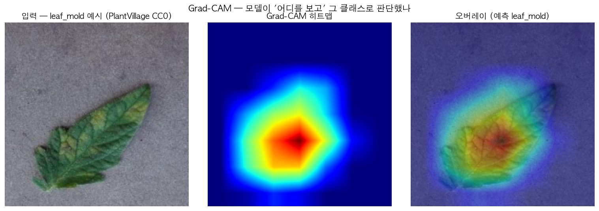

# 🌱 SmartFarm AI — 작물 재배 도우미 (ML → DL → LLM)

> **센서는 환경 숫자를 보여주지만, 이 AI는 작물에 뭘 해줘야 할지를 알려준다.**
> 스마트팜 환경·잎 사진을 받아 **작물 분류 → 잎 병해충 진단 → 자연어 처방**까지 가는 멀티모달 AI.
> 작물 **토마토 단일로 시작 → 전이학습으로 다작물 확장** (딸기·오이·참외…).

[](https://www.python.org/)


[](https://smartfarm-ai.rkqkdrnportfolio.shop)

> 🚀 **통합 라이브 데모 (ML·DL·LLM 한 페이지):** **https://smartfarm-ai.rkqkdrnportfolio.shop**
> 📄 **수행내역서:** [① ML](docs/phase1_ml.md) · [② DL](docs/phase2_dl.md) · [③ LLM](docs/phase3_llm.md)

---

## 📌 진행 단계

| Phase | 내용 | 기술 | 핵심 성과 | 상태 |
|---|---|---|---|---|
| **1. ML** | 환경 센서 → 작물 9종 분류 (2022~24 다년) | RandomForest·XGBoost | test F1 0.68 · **GKF 0.49**(누수 교훈) | ✅ 완료 |
| **2. DL** | 잎 사진 진단(CNN·YOLO) + 환경 시계열(LSTM) | PyTorch·전이학습·Grad-CAM·MLflow | 진단 acc **0.97** · YOLO 0.78 · LSTM 1.18℃ | ✅ 완료 |
| **3. LLM** | 진단+환경 → 자연어 처방·알림 | Claude API·RAG | — | ⚪ 예정 |

**목차** · [🌱 Phase 1 ML](#-phase-1-ml--환경-기반-작물-분류) · [🍃 Phase 2 DL](#-phase-2-dl--잎-병해-진단--환경-시계열) · [💬 Phase 3 LLM](#-phase-3-llm--자연어-처방-예정) · [🗂️ 구조·데이터·실행](#️-구조--데이터--실행)

> 문서: [PRD](docs/prd.md) · [로드맵](docs/roadmap.md) · [설계 결정(ADR)](docs/decisions.md)

---

## 🌱 Phase 1 (ML) — 환경 기반 작물 분류

농진청 스마트팜 현장 농가 데이터(**2022~2024 다년 결합**)로 **환경 센서 → 작물 9종 분류**.

- 🏆 **XGBoost 베스트** — test F1 **0.68** · 정직한 일반화 **GroupKFold F1 0.49**
- 🔑 **데이터 누수 실증** — 랜덤 분리 F1 **0.67** vs 농가 단위(GroupKFold) **0.49** → 같은 농가가 train·test에 섞이면 성능 과대평가. 진짜 성능은 0.49.
- 📈 **데이터 양 효과** — 단년→다년(3.5배)으로 공통 8작물 F1 **+0.073**, 누수 격차 36%p→18%p 완화, 수박 신규 커버.


<details>
<summary><b>📊 상세 — 데이터 · 평가 3겹 · 데이터 양 효과</b></summary>

- 288만 시간별 → **116,365 일별 집계**, 9작물(완숙·방울토마토·딸기·오이·참외·파프리카·가지·국화·수박)
- **평가 3겹:** Test F1 0.68 · StratifiedKFold 0.67(낙관적) · **GroupKFold 0.49**(현실적 — 처음 보는 농가)
- 트리 부스팅(XGBoost·RF)이 선형(로지스틱 0.33) 대비 압도 → 환경↔작물은 **비선형**
- 데이터 양 효과(작물별 recall): 방울토마토 +0.24 · 오이 +0.18 · 가지 +0.14, 수박은 단년엔 불가 → 다년 신규 커버
- 한계: 환경은 농가가 **제어하는 값**이라 작물 고유 신호가 약함 → 새 농가 일반화(0.49)는 본질적 난제
- 자세히 → **[phase1_ml.md](docs/phase1_ml.md)**

</details>

🚀 **데모:** [통합 앱 → **Phase 1 · ML** 탭](https://smartfarm-ai.rkqkdrnportfolio.shop) — 환경값 슬라이더 입력 → 작물 9종 예측·신뢰도 Top3

---

## 🍃 Phase 2 (DL) — 잎 병해 진단 + 환경 시계열

토마토 잎 사진 → **3분류 진단(CNN)** + **병해 잎 위치 검출(YOLO)** + 환경 **시계열 예측(LSTM)**. ML이 못 하던 **이미지·순서** 모달리티를 더하고 설명가능 AI까지.

- 🏆 **전이학습 3분류**(정상·잎곰팡이병·황화잎말이) — 서빙 ResNet18 **acc 0.97 · ROC-AUC 0.997** (백본 best mobilenet_v2 0.987, **MLflow** 추적)
- 🔍 **Grad-CAM** 판단 근거 시각화(+한계 직시) + **YOLOv8n** 위치 검출 **mAP@50 0.78** — "진단 → 근거 → 위치"
- 🛡️ **2단 게이트** — 식물(plant_score<0.04) + **부위 분류기(acc 0.932)** 로 과육·비잎 입력 오진 차단
- 📉 **다변량 LSTM** — 환경 8변수·485개 다년 시계열로 baseline(1.25℃) 추월 → **MAE 1.18℃**



<details>
<summary><b>📊 상세 — 데이터 정제 · 평가 · 트러블슈팅</b></summary>

- 🔑 **데이터 정제(핵심):** AI Hub 071 정상 원천에 과실·꽃·줄기 혼재 → 부위 라벨로 **잎(area=3)만 선별** + 질병 Train 확보(정상 1,330·질병 2,616) → 정확도 0.94→0.97~0.99
- **평가 심화:** 3×3 혼동행렬(병종 혼동 적음) · **FN 6건** · 불균형 가중치(질병 recall 0.86/0.93 → 0.96/0.98)
- **검출:** YOLOv8n 3클래스 전이학습(mAP@50 0.78) · **시계열:** 단년 1.22 → 다년 1.18℃(데이터 양 효과 재현)
- 자세히 → **[phase2_dl.md](docs/phase2_dl.md)** · 막혔던 곳 → **[트러블슈팅](docs/troubleshooting/troubleshooting.md)**

</details>

🚀 **데모:** [통합 앱 → **Phase 2 · DL** 탭](https://smartfarm-ai.rkqkdrnportfolio.shop) — 잎 사진 업로드 → 진단+Grad-CAM · YOLO 위치 검출

---

## 💬 Phase 3 (LLM) — 자연어 처방 (예정)

**CNN 진단 + LSTM 예측 + 재배가이드(RAG) → LLM 자연어 처방 → 🔔 알림.** 숫자·라벨을 사람이 읽는 "처방"으로.

<details>
<summary><b>🚧 로드맵 — 4단계 + 목표 출력</b></summary>

- **3-1 Claude API** — 진단·예측 숫자/라벨 → 자연어 처방 생성
- **3-2 RAG** — 농사로 재배가이드 검색 → 근거 있는 조언
- **3-3 통합 파이프라인** — ML/LSTM 예측 + CNN 진단 + RAG → 처방 통합
- **3-4 알림·대시보드** — 텔레그램 알림봇 + Streamlit 통합 대시보드
- **🎯 목표 출력:** 🔬 잎곰팡이병 의심(87%) 감염 잎 제거·습도↓ · 💧 토양수분 30% 낮음 관수 · 🌡️ 2시간 뒤 32℃ 환기 준비

</details>

---

## 🗂️ 구조 · 데이터 · 실행

<details>
<summary><b>📁 디렉터리 구조</b></summary>

```
smartfarm-ai/
├── src/ml/        preprocess.py · train.py          (Phase 1)
├── src/dl/        01_basics ~ 05_detect · prepare_tomato (Phase 2 — CNN·YOLO·LSTM)
├── app/           home.py · phase1_ml.py · phase2_dl.py · phase3_llm.py  (Streamlit 멀티페이지, OCI 배포)
├── data/          데이터 (git 제외 — 포털에서 재다운)
├── models/        학습 모델 (.pt — git 제외, rsync 배포)
└── docs/          PRD · 로드맵 · ADR · Phase 수행내역서 · 그림 · 트러블슈팅
```

</details>

<details>
<summary><b>📊 데이터 출처</b></summary>

- **ML:** [농촌진흥청 스마트팜 현장 농가 데이터](https://www.data.go.kr/data/15108734/fileData.do) (공공데이터포털)
- **DL:** [AI Hub 「시설작물 질병진단」(071)](https://aihub.or.kr/aihubdata/data/view.do?dataSetSn=153) · PlantVillage(CC0)
- 데이터는 용량이 커서 git에 포함하지 않음 (위 출처에서 재다운로드) · 상세 → [data_sources.md](docs/data_sources.md)

</details>

<details>
<summary><b>🔧 실행</b></summary>

```bash
uv venv && uv pip install -r requirements.txt
python src/ml/preprocess.py    # 환경 데이터 → 일별 집계
python src/ml/train.py         # ML 모델 학습·평가·저장
streamlit run app/streamlit_app.py   # 통합 데모(홈 + Phase 1~3)
```

</details>

---

## 🌿 관련 레포

- **[smartfarm_ml_learn](https://github.com/luma200ok/smartfarm_ml_learn)** — ML 입문 단계(노지 작물 추천, Kaggle Crop Recommendation). 이 프로젝트의 **출발점(v1)**으로, 범용 ML 학습 후 본 레포에서 스마트팜에 특화. (→ [ADR-001](docs/decisions.md))

---

© 2026 luma200ok(정재봉). 학습·포트폴리오 목적 프로젝트.
