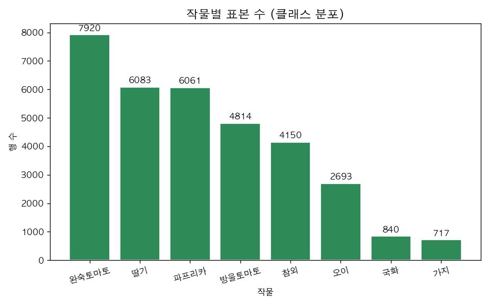
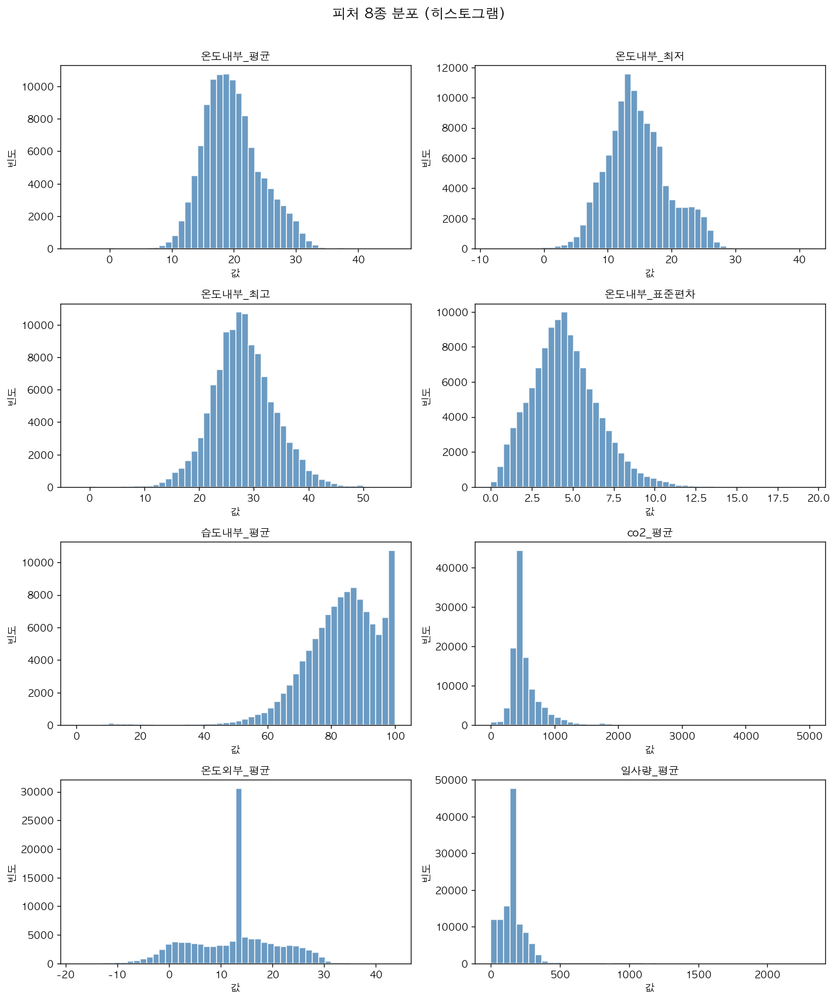
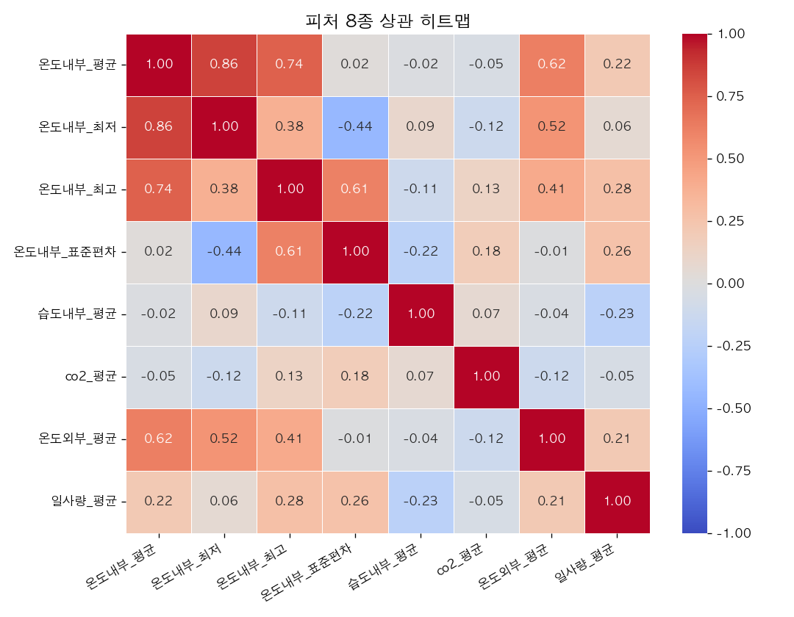
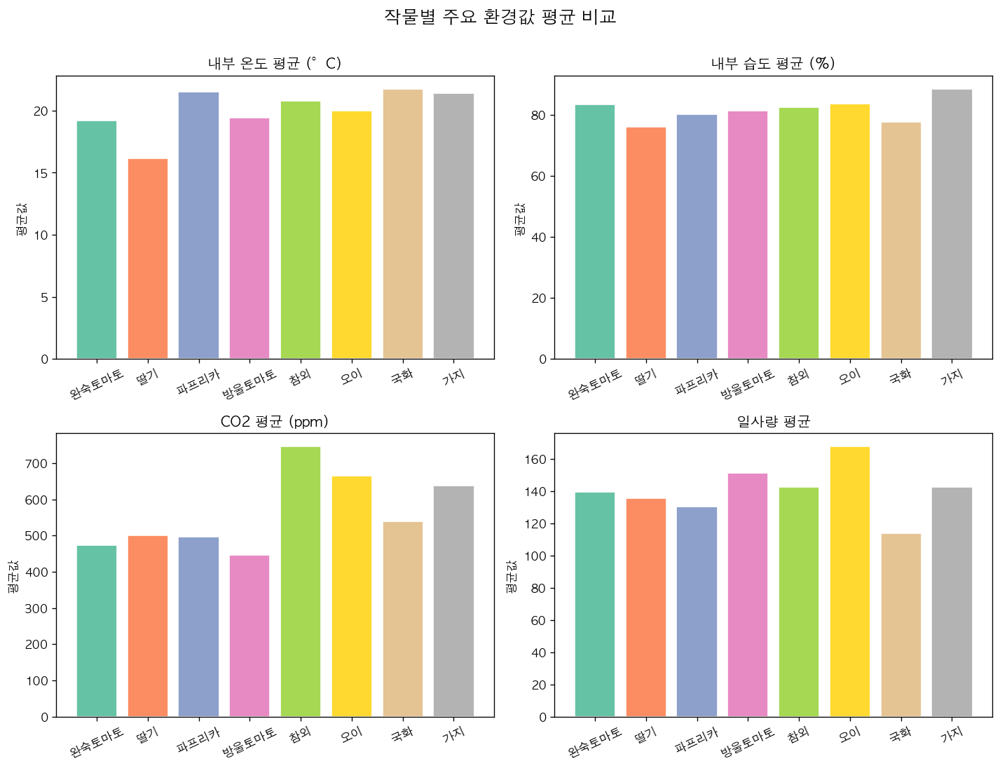
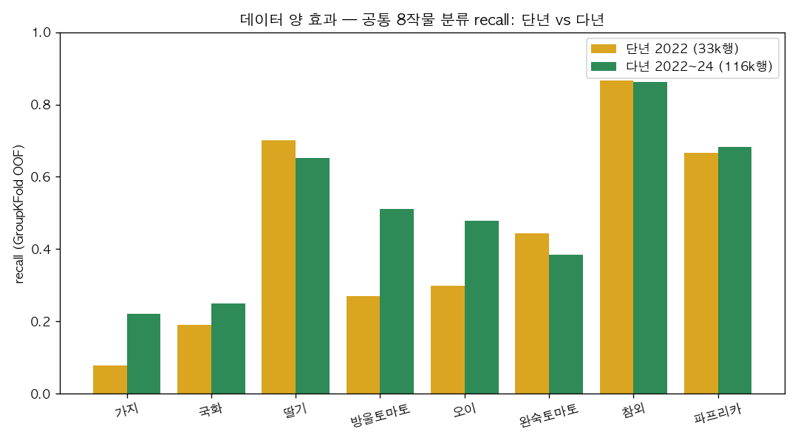

# 📄 AI개발 수행내역서 — Phase 1 (ML)

> 스마트팜 **환경 센서 데이터로 재배 작물(9종)을 분류**하는 머신러닝 모델 개발.
> 데이터: 농촌진흥청 스마트팜 현장 농가 데이터(국내 시설재배 실데이터, **2022~2024 3개년 결합**).
> ← [PRD](prd.md) · [설계 결정 ADR](decisions.md) · 다음 → [phase2_dl.md](phase2_dl.md)

| 항목 | 내용 |
|---|---|
| 과제 | 환경(온·습도·CO2·일사 등) → 작물 9종 분류 |
| 데이터 | 농진청 스마트팜 현장 농가 데이터(**2022~2024**) — 288만 시간별 → 116,365 일별 |
| 베스트 모델 | XGBoost (test F1 0.68 · GroupKFold F1 0.49) |
| 코드 | https://github.com/luma200ok/smartfarm_ai |
| 🚀 데모 | https://smartfarm-ai.luma200ok.com |
| 핵심 교훈 | **데이터 누수**(랜덤 0.67 vs 농가분리 0.49) + **다년 결합 효과**(공통 8작물 F1 +0.073) |

---

## 1. 사업과제
- AI 기반 **스마트팜 작물 분류 모델** 개발 및 시각화.
- 국내 시설재배(양액·온실) 환경 데이터를 사용해, 노지 입문(이전 레포 [smartfarm_ml_learn](https://github.com/luma200ok/smartfarm_ml_learn))에서 **스마트팜 특화**로 발전한 1단계. (→ [ADR-001](decisions.md))

## 2. 개요 및 현황
### 2.1 추진배경 및 목적
- 스마트팜 대시보드는 "현재 환경값"만 보여줌 → **환경 데이터로 의미(어떤 작물 재배환경인지)를 읽는** ML이 1단계.
- 향후 잎 진단(Phase 2 DL)·자연어 처방(Phase 3 LLM)으로 확장. 작물은 **토마토 단일로 시작 → 다작물 확장** (→ [ADR-002](decisions.md)).

### 2.2 과제 범위
- 입력: 시설 내·외부 환경 센서(시간별) → **일별 집계** 통계
- 출력: 재배 작물 9종(완숙토마토·방울토마토·딸기·오이·참외·파프리카·가지·국화·**수박**) 분류
  - ※ 수박은 2023년부터 데이터에 등장 → **다년 결합으로 신규 커버**(2022 단년이면 8종)
- 모델 3종 비교 + **평가 3겹**(데이터 누수 점검 포함) + **단년 vs 다년 비교**

### 2.3 과제 추진 방법
1. 환경 시간별 데이터 → 농가·작기·작물·일자 단위 일별 집계
2. 환경 통계 피처 8종 구성(식별자 제외 → 누수 방지)
3. 로지스틱·RandomForest·XGBoost 비교 → 베스트 선정
4. test / StratifiedKFold / **GroupKFold(농가)** 3겹 평가

## 3. 데이터
### 3.1 데이터 수집
- **농촌진흥청 스마트팜 현장 농가 데이터** (공공데이터포털) — 시설채소 농가의 환경·생육·생산·재배정보.
- 본 과제는 **2022~2024년 3개년 환경 데이터** 결합 사용: 약 288만 행(시간별), 농가 48곳.
  - 처음엔 2022 단년(83만 행)으로 시작 → **최신·다년치로 확장**해 농가·작물 다양성 확보(→ §6.5 비교).
  - ⚠️ 연도별 CO2 컬럼명이 제각각(`잔존이산화탄소(CO2)`/`잔존 CO2`…)이라 **표준화 후 결합**.

### 3.2 변수 구성 (피처 8종)
| 피처 | 설명 |
|---|---|
| 온도내부_평균/최저/최고/표준편차 | 일별 내부 기온 통계(일교차 반영) |
| 습도내부_평균 | 일별 내부 상대습도 |
| co2_평균 | 일별 CO2 농도 |
| 온도외부_평균 · 일사량_평균 | 외부 환경 |

- 시간별(1h) → **일별 집계**로 노이즈↓·행수↓ (288만 → 116,365행).
- ⚠️ **누수 방지:** 농가명·도·시군 등 식별자는 **피처에서 제외**(환경 통계만 사용).

### 3.3 판단 결과(종속변수)
- 작물 9종. **불균형 존재**: 방울토마토 25,241 ~ 수박 1,023 (약 25배).

## 4. 탐색적 데이터 분석 (EDA)

### 4.1 클래스 분포


방울토마토(25,241) ~ 수박(1,023) 약 **25배 불균형**. 소수 클래스(수박·국화·가지)를 Accuracy로는 놓치기 쉬워 **F1(macro)** 중심 평가가 필수.

### 4.2 피처 분포


내부 온도는 작물·계절별로 제어값이 달라 분포 폭이 넓음. CO2는 일부 농가에서 인위적 주입으로 우측 긴 꼬리.

### 4.3 피처 상관


내부 온도 계열(평균·최저·최고)끼리 상관 0.8 이상 — 다중공선성 존재. CO2는 상관이 낮아 독립적인 정보 기여.

### 4.4 작물별 환경 평균 비교


작물마다 선호 환경이 다름 — 딸기는 낮은 온도·높은 습도, 참외는 높은 일사량, 파프리카는 CO2 높음 등. 이 차이가 분류 가능성의 근거.

---

- **농가당 여러 작물** 재배(1:1 아님) → 농가=작물 직접 누수는 낮으나, 같은 농가/작기가 train·test에 분산되면 **간접 누수** 가능 → GroupKFold로 점검.
- 내부 센서(온·습도) 결측 적음, 외부 센서(풍향·토양온도) 결측 많음 → 내부 중심 피처 선택.

## 5. 데이터 전처리
- 측정시간 → 날짜 변환 후 (농가·작기·작물·일자) 집계.
- 결측: 핵심 센서(내부 온·습도) 결측 행 제거, 보조 피처는 중앙값 보간.
- 로지스틱 회귀는 `StandardScaler` 파이프라인 적용.

## 6. 모델 정의 및 학습
### 6.1 모델 비교
| 모델 | Test Accuracy | Test F1(macro) |
|---|---|---|
| LogisticRegression | 0.38 | 0.33 |
| RandomForest | 0.75 | 0.70 |
| **XGBoost (베스트)** | **0.72** | **0.68** |

→ 트리 기반(RF·XGB)이 선형(로지스틱) 대비 압도적. 환경↔작물 관계가 **비선형**임을 시사. ([model_compare.png](figures/phase1_ml/model_compare.png))
> RF·XGB는 GroupKFold F1이 0.496 vs 0.492로 **통계적 동률**(std 0.04 이내) → Phase1 일관성·표데이터 관례상 **XGBoost** 채택(단년 베스트와 동일 모델로 고정해 '데이터 양 효과'만 비교).

### 6.2 ⭐ 평가 3겹 — 데이터 누수의 교훈 (이 프로젝트의 핵심)
| 평가 방법 | F1(macro) | 의미 |
|---|---|---|
| ① Test set (stratify) | 0.68 | 단일 분할 |
| ② StratifiedKFold(5) | **0.67** | 낙관적 — 같은 농가가 train·test에 섞임 |
| ③ **GroupKFold(연도+농가+작기)** | **0.49** | 현실적 — **처음 보는 농가**로 평가 |

> 🔑 **랜덤 분리 0.67 vs 농가 단위 분리 0.49 — 18%p 격차.**
> 랜덤 분리는 모델이 "농가·작기 고유 패턴"을 외워 **성능을 과대평가**한다. 진짜 일반화(새 농가) 성능은 **0.49**가 정직한 값.
> → Phase 1(노지)에서 배운 **데이터 누수**가 실데이터에서 그대로 재현됨. "한 숫자만 믿지 말 것"의 실증.
> 📈 단년(2022)일 땐 격차가 **0.77 vs 0.41(36%p)** 로 더 컸다 → **다년 결합으로 18%p까지 완화**(데이터 다양성이 과적합을 줄임, → §6.5).

### 6.3 피처 중요도
- RandomForest 기준 환경 피처 기여도 → [feature_importance.png](figures/phase1_ml/feature_importance.png).
- 내부 온도·습도가 작물 구분의 핵심 신호.

### 6.4 작물별 성능 (XGBoost)
- 잘 구분: **참외 F1 0.86**, 파프리카 0.78, 딸기 0.76.
- 약함: 수박 0.48·국화 0.56 (표본 적음). → [confusion_matrix.png](figures/phase1_ml/confusion_matrix.png)

### 6.5 ⭐ 단년(2022) vs 다년(2022~2024) 결합 — 데이터 양 효과


학습 데이터를 **2022 단년(33,278행) → 2022~24 다년(116,365행, 3.5배)** 으로 늘리고, **공통 8작물**을 **동일한 GroupKFold(누수 차단)** 로 비교(클래스 수가 8→9로 달라지면 불공정하므로 공통 작물의 per-class로 측정).

| 지표 | 단년 2022 | 다년 2022~24 |
|---|---|---|
| 공통 8작물 macro-F1 | 0.439 | **0.512 (+0.073)** |
| 데이터 누수 격차(SKF−GKF) | 36%p | **18%p (완화)** |
| 커버 작물 | 8종 | **9종(수박 추가)** |

**작물별 recall 변화 (단년 → 다년)**

| 변화 | 작물 |
|---|---|
| 크게 향상 ⬆️ | 방울토마토 0.27→0.51 **(+0.24)** · 오이 0.30→0.48 **(+0.18)** · 가지 0.08→0.22 **(+0.14)** |
| 유지 | 참외·파프리카·딸기 (이미 충분한 표본 → 포화) |
| 신규 🆕 | 수박 recall 0.27 (단년엔 불가) |

> 🔑 **데이터가 적던 작물일수록 다년 결합 효과가 크다**(전형적 학습곡선). 이미 표본이 풍부하던 작물(참외·파프리카)은 포화. + 데이터 다양성이 늘며 **누수 격차도 완화**(36%p→18%p) — "데이터를 늘리면 모델이 농가 고유 패턴에 덜 과적합한다"의 실증.
> 재현: `python src/ml/preprocess.py && python src/ml/compare_years.py`

## 7. 산출물 및 실행 방법

### 7.1 Streamlit 데모
환경값 슬라이더 입력 → XGBoost 작물 예측 + 신뢰도 Top3 + 환경 비교표를 4탭으로 제공.

```bash
# 프로젝트 루트에서 실행
streamlit run app/phase1_ml.py
```

- 코드: [`app/phase1_ml.py`](../app/phase1_ml.py)
- 🔗 라이브 데모: https://smartfarm-ai.luma200ok.com (OCI 자체 서버 배포 — Caddy+systemd)

### 7.2 파이프라인 재현 노트북
데이터 로드 → EDA → 전처리 → 모델 3종 학습·평가 → GroupKFold 교훈까지 단계별로 실행 가능.

```bash
# 노트북 재생성(선택)
python src/ml/build_notebook.py
# 또는 JupyterLab에서 직접 열기
jupyter lab notebooks/phase1_ml.ipynb
```

- 코드: [`notebooks/phase1_ml.ipynb`](../notebooks/phase1_ml.ipynb)

---

## 8. 결론 및 제안
- **성과:** 국내 스마트팜 환경 데이터로 작물 9종 분류 파이프라인 구축(XGBoost — 정직한 일반화 GroupKFold F1 **0.49**, 낙관적 test F1 0.68). 모델 비교 + 평가 3겹 + 누수 점검 + **다년 결합(2022~24)으로 데이터 양 효과 검증**까지 완비.
- **한계:** 환경 센서는 농가가 **제어하는 값**이라 작물 고유 신호가 약함 → 새 농가 일반화(0.49)는 여전히 어려움. 환경만으로 작물 식별엔 본질적 한계.
- **개선 방향:**
  - 계절·생육단계 피처 추가(작물의 계절성 반영)
  - ✅ ~~다년치 결합으로 농가 다양성 확보~~ → **2022~2024 결합 완료**(§6.5). 추가로 2020~2021까지 확장 여지.
  - 생육 데이터 결합(환경→생육→작물) 멀티모달
- **확장:** 같은 작물(토마토)을 Phase 2(잎 진단)·Phase 3(처방)로 관통 → 데이터 있는 작물로 확장 (→ [ADR-002](decisions.md)).

## 📌 배운점 (회고)
- **데이터 누수는 실데이터에서 더 교묘하다.** 노지 입문(이전 레포 [smartfarm_ml_learn](https://github.com/luma200ok/smartfarm_ml_learn))은 깔끔한 공개 데이터라 99.5%였지만, 현장 데이터는 농가·계절 등 숨은 그룹 구조 때문에 랜덤 분리가 성능을 부풀린다. → **GroupKFold로 그룹 단위 평가**가 필수.
- **정직한 0.49**가 낙관적 0.67보다 가치 있다. 평가 설계가 모델만큼 중요.
- **데이터를 늘리면 누수에 덜 취약하다.** 단년 36%p → 다년 18%p로 누수 격차가 줄었다 — 다양성이 과적합을 완화(§6.5).
- 불균형 데이터는 Accuracy가 아니라 **F1(macro)** 로 봐야 작은 클래스(수박·국화)가 보인다.
- 트리 부스팅(XGBoost)이 표 데이터에서 여전히 강하다.
